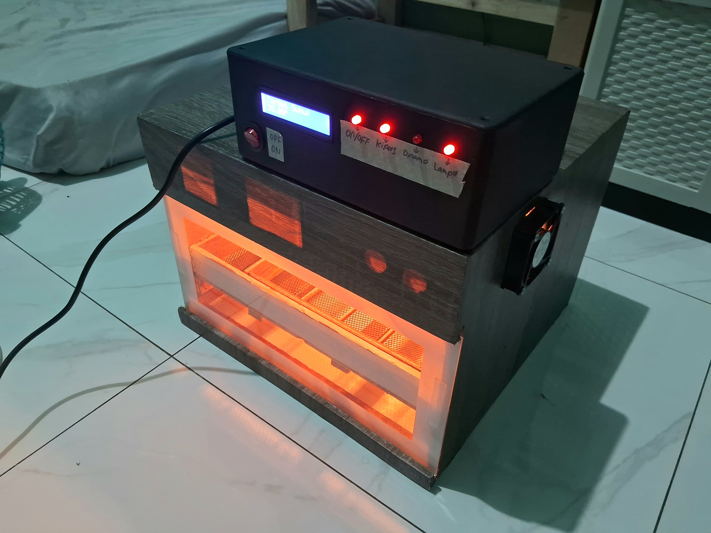

# 🌡️ IoT Egg Incubator Controller with ESP32

This project is an **IoT-based incubator controller** built with ESP32. It uses temperature and humidity data to automatically control a dimmable lamp (heater), fans, and a timed relay for optimal egg incubation. The system supports remote control and monitoring using **Blynk** and logs real-time data to **ThingSpeak**.

> ⚠️ **Note**: Some variable names in this code are written in **Bahasa Indonesia** (e.g., `batasSuhu`, `kontrolLampu`, `kipas`, etc.).

---

## 📷 System Overview


---



---

## 🚀 Features

- 🔥 Automatic **temperature control** with dimmer lamp
- 💨 **Humidity & temperature-based fan control**
- ⏱️ Scheduled **relay activation**
- 📲 Remote control via **Blynk**
- 📡 Data logging via **ThingSpeak**
- 📟 Real-time status display on **I2C LCD**
- 🖥️ Local control via **Serial Monitor**

---

## 🛠️ Hardware Required

| Component              | Description                     |
|------------------------|---------------------------------|
| ESP32 Dev Board        | Main microcontroller            |
| DHT22                  | Temperature & humidity sensor   |
| 16x2 I2C LCD           | Display                         |
| L298N Motor Driver     | Controls 2 fans                 |
| AC Dimmer Module       | Controls lamp brightness        |
| Relay Module           | Controls motor/heater           |
| LEDs x3                | Indicators for dimmer/fan/relay |
| Lamp (AC)              | Used as incubator heat source   |
| 2x DC Fans             | For humidity/temp regulation    |
| Power Supply           | Depends on motor/fan specs      |

---

## 📦 Software Libraries

Install these from the Arduino Library Manager:

- `WiFi.h`
- `HTTPClient.h`
- `ThingSpeak`
- `Blynk` (with Blynk ESP32 support)
- `DHT sensor library`
- `LiquidCrystal_I2C`
- `RBDdimmer`

---

## 🔧 Configuration

Update the following credentials in the `.ino` file before uploading:

```cpp
const char* ssid = "your-wifi-ssid";
const char* password = "your-wifi-password";

#define channelID 0000000
#define apiKey "your-thingspeak-api-key"

#define BLYNK_TEMPLATE_ID "your-blynk-template-id"
#define BLYNK_TEMPLATE_NAME "your-blynk-template-name"
#define BLYNK_AUTH_TOKEN "your-blynk-auth-token"
```

---

## 🧠 System Logic

### 💡 Lamp Brightness Control

- Lamp is controlled using a dimmer via `RBDdimmer`.
- Brightness is calculated based on the difference between actual and target temperature.
- If temperature is far below the target → lamp at full brightness.
- As it nears the target → brightness is reduced using a braking zone.
- If it overshoots the target → lamp dims or turns off.
- A status LED shows whether the lamp is on.

### 💨 Fan Speed Control

- Fans are controlled using PWM via L298N motor driver.
- Fan speed increases with rising humidity or excess heat.
- Speed varies from idle (20%) to full power (100%) depending on error.
- Additional humidity error is also considered to boost airflow when needed.
- Fan direction and speed are controlled via 4 L298N pins + 2 PWM pins.

### 🔁 Relay Timing

- The relay is automatically activated every 2 hours for 25 seconds.
- Uses non-blocking `millis()` timing (no `delay()`).
- Relay status is shown on LCD and can be overridden via Blynk V1 button.
- A status LED shows the relay state.

### 📟 LCD Display Logic

- Shows three rotating screens every 3 seconds:
  1. Humidity and Temperature
  2. Fan Speed and Lamp Brightness
  3. Target Temperature

### 📲 Blynk App Controls

| Virtual Pin | Function               |
|-------------|------------------------|
| V0          | Set target temperature |
| V1          | Turn relay ON/OFF      |

- You must set these in your **Blynk template**.
- Relay and target temperature can be controlled from your phone.

---

## 📤 ThingSpeak Logging

| Field | Data                   |
|-------|------------------------|
| 1     | Temperature (°C)       |
| 2     | Humidity (%)           |
| 3     | Lamp Brightness (%)    |
| 4     | Fan Speed (%)          |

- Data is sent every loop (~100 ms delay, can be increased).
- Make sure your channel ID and API key are correct and private/public as you prefer.

---

## 🧪 Serial Monitor

You can manually input the target temperature via the **Arduino Serial Monitor**:

```text
> Enter target temperature via Serial Monitor:
> Target Temperature: 37.5
```

- Uses `Serial.parseFloat()` to capture the input.
- A delay is added to prevent multiple reads.
- Displays system status (temp, humidity, fan speed, lamp) in the monitor.

---

## 👨‍💻 Author

Made with ❤️ by EgidiusDicky 
Feel free to fork, contribute, or raise issues!

---

## 📜 License

This project is licensed under the [MIT License](LICENSE).